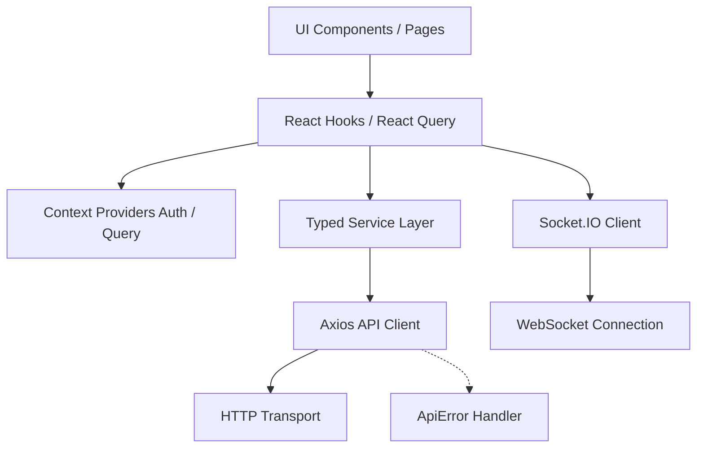

# Frontend Architecture & Data Flow

This document details the architectural design, state management, real-time connectivity, and styling paradigms of the British Auction platform's frontend application.

## 1. Core Architecture Pattern

The frontend follows a **Service-Oriented Hook Architecture**, strictly diverging from standard component-level data fetching. It is built on React 19 / Next.js 16 (App Router) but heavily relies on Client Components (`'use client'`) due to the intense real-time nature of Reverse Auctions.



## 2. The Connection Layer

We utilize a centralized `apiClient` (Axios) configured with robust interceptors to establish a fortress around data egress/ingress.

### 2.1 The Request Interceptor
Every outgoing request automatically retrieves the JWT from `localStorage` and injects it as a `Bearer` token. This means UI components never manually handle authorization headers.

### 2.2 The Response Interceptor (The Automatic Unwrap)
The backend strictly adheres to a standard envelope: `{ success: boolean, data: T, message: string }`.
Our frontend response interceptor detects this envelope and **automatically unwraps it**.
When a UI function calls `rfqService.getAllRfqs()`, it receives `RFQ[]` directly, completely avoiding `.data.data` boilerplate.

### 2.3 `ApiError` & Global 401 Handling
When an error occurs, the interceptor wraps it in a custom `ApiError` class.
- **Validation Blocks:** Intercepts Zod `400 Bad Request` schema failures, making `error.errors` natively accessible to form handlers.
- **Global Auth Expiry:** If a `401 Unauthorized` occurs anywhere in the app, the interceptor silently dispatches an `AUTH_EXPIRED_EVENT`. The `AuthProvider` listens for this event and forcibly logs the user out, purging state globally across all open tabs.

## 3. State Management Strategy

We divide state into two distinct boundaries to prevent prop-drilling and eliminate infinite-render loops.

### 3.1 Global Authentication State (`AuthProvider`)
Built with React Context, this provider wraps the entire application.
It exposes a clean `useAuth()` hook delivering:
- `user`, `token`, `isAuthenticated`, `isLoading`
- `login()`, `register()`, `logout()` mutations

### 3.2 Asynchronous Server State (`TanStack React Query`)
Replaces `useEffect` chaining for data fetching.
- **Caching & Stale Time:** Configured with a `30s` stale time. Auctions move fast, but we rely on WebSockets for real-time injections. React Query acts as the resilient backbone.
- **Smart Retries:** The `QueryProvider` is configured to retry network drops twice, but strictly **aborts retries** if the failure is identified as an `ApiError` representing a validation (`400`) or authorization (`401`) fault.

## 4. Real-Time Synchronization (Socket.IO)

Reverse auctions require sub-second UI updates. Polling is technically inferior and resource-heavy. 
We utilize a singleton `socketClient`.

### 4.1 Arena Mechanics
When a user navigates to `/buyer/rfq/[id]` or `/supplier/rfq/[id]`:
1. `SocketClient.connect()` initializes the WebSocket multiplexing.
2. `socketClient.joinRfqRoom(rfqId)` binds the user exclusively to that auction's broadcast channel.

### 4.2 Cache Injection (Optimistic-style Updates)
Instead of relying on React state (`useState`) to store the active RFQ data, the WebSocket engine reaches *directly* into the React Query Cache.

```typescript
socket.on('BID_PLACED', (newBid) => {
  queryClient.setQueryData(['rfq', rfqId], (oldData) => {
     // Natively unshift the new bid into the UI without triggering a hard HTTP refetch!
  });
});
```

### 4.3 Extension Triggers
If an `AUCTION_EXTENDED` event fires over the socket:
1. The cache's `close_time` is updated.
2. A temporary local state `extended = true` is triggered, causing Framer Motion to flash an amber alert banner on screen.
3. The custom `useCountdown` hook natively picks up the new timestamp and dynamically expands the clock.

## 5. Form Engineering & Validation

Forms are built using **React Hook Form (RHF)** coupled with `@hookform/resolvers/zod`.
- The Zod schemas on the frontend (`bidSchema`, `rfqSchema`) exactly mirror the validation rules of the NestJS backend.
- RHF handles input registration without forcing full-page re-renders on every keystroke.
- We utilize `valueAsNumber: true` directly in the inputs to ensure strict Type cohesion between pure HTML events and Zod primitives.

## 6. The Design System & UX

The UI relies entirely on modern TailwindCSS v4 and Framer Motion. 

### 6.1 Glassmorphism & Token Architecture
Instead of hardcoded colors, the entire system utilizes dynamic CSS variables bounded in `globals.css`.
- `.glass-card`: Utilizes strong `backdrop-filter: blur(24px)` against a midnight background (`#05050A`) to create depth without relying on flat borders.

### 6.2 Micro-Interactions (Framer Motion)
- **Staggered Entries:** Dashboard cards use indexed variants (`delay: i * 0.08`) to animate sequentially onto the screen.
- **Layout Shifting:** The live Bid Leaderboard utilizes `<AnimatePresence mode="popLayout">` and `layout` props. When a new bid is placed, the existing bids literally slide downward on the Y-axis to make room for the new rank, rather than snapping jarringly.
- **Urgency Flashing:** The central timer actively targets `text-amber-400` with an animated drop-shadow pulse during the final 120 seconds of an auction.

## 7. Folder Structure Hierarchy

```text
src/
├── app/                  # Next.js App Router boundary
│   ├── auth/             # Login / Register flows
│   ├── buyer/            # Buyer Dashboard & Route protecting
│   ├── supplier/         # Supplier Dashboard & Live Arenas
│   ├── globals.css       # Core Design System engine
│   └── layout.tsx        # Integrates AuthProvider & QueryProvider
├── hooks/                # Custom React logic (e.g. useCountdown)
├── lib/                  # Framework initialization
│   ├── api-client.ts     # Axios instance & interceptors
│   ├── api-error.ts      # Custom Error taxonomy
│   └── socket.ts         # Singleton WebSocket connection
├── providers/            # React Contexts
│   ├── auth-provider.tsx 
│   └── query-provider.tsx
├── services/             # Strictly Typed API Callers
│   ├── auth.service.ts
│   ├── rfq.service.ts
│   └── bid.service.ts
└── types/                # End-to-end TS interfaces mapping to Prisma
    └── api.ts
```
